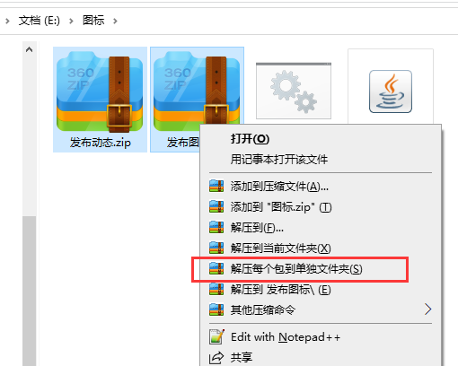
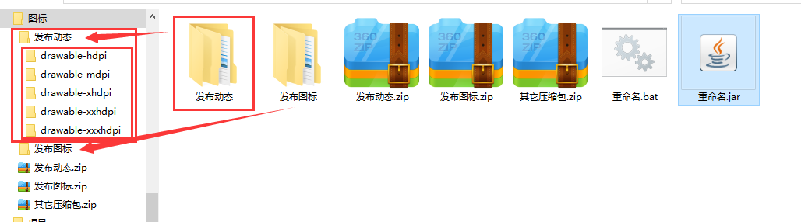
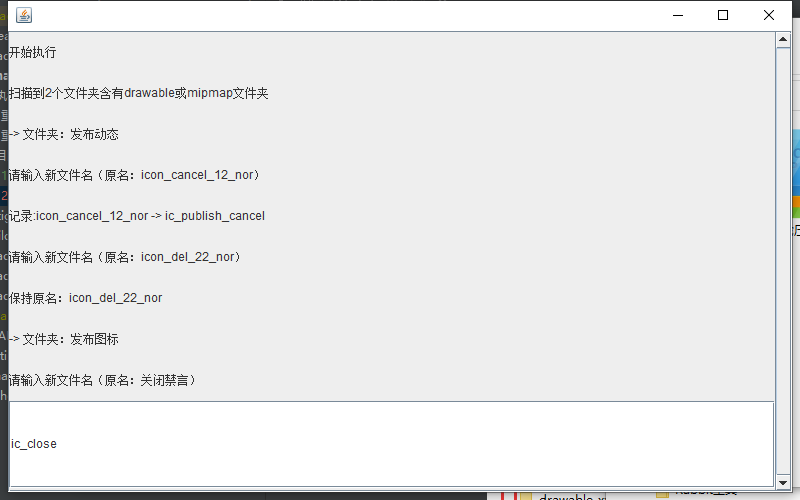

## 使用说明

- “rename”目录下为源码
- “可执行文件”目录下为可执行文件

可只下载“可执行文件”目录下的文件
1. 重命名(无界面)(改为目录名).bat
- 修改同级目录下，XXX/drawable[mipmap]-?/?.png，所有单组png改为XXX.png
- 仅支持Windows系统，mipmap/drawable下单组图片修改。
- 操作：双击启动-等待完毕提示-回车关闭

2. 重命名.jar
- 修改同级目录下，XXX/drawable[mipmap]-?/?.png，按操作界面提示，修改多组png。
- 需Java环境，按原文件名分多组改名。
- 操作：双击启动-输入新名-回车-输入新名-回车……-回车关闭（不输入直接回车代表保持原名不修改）

### 修改源码后jar打包
1. 在AndroidStudio上pull项目，并build完毕
2. 打开rename\build.gradle，运行task makeJar（左侧三角键）
3. build完毕后，复制“可执行文件/重命名.jar”到图片文件夹同级目录下

### 图片文件位置
1. 蓝湖、摹客等网站，多选或单选后，下载的图片压缩包为 压缩包/drawable-?或mipmap-?/图片文件
2. 下载至“.jar”或“.bat”文件的同目录下，选中单个或多个压缩包，右键->选择"解压到（各压缩包名）下"
3. 双击“.jar”或“.bat”文件，根据提示操作或自动操作，完成后按回车关闭

### jar包操作截图

